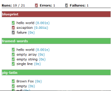

# Exercises in JavaScipt

 

- **Author:** [Stef Schulz](mailto:s.schulz@slothsoft.de)
- **Repository:** <https://github.com/slothsoft/exercises-javascript>
- **Open Issues:** <https://github.com/slothsoft/exercises-javascript/issues>
- **Website:** [Hosted on GitHub](https://slothsoft.github.io/exercises-javascript/)
- **Test Report:** [Hosted on GitHub](https://slothsoft.github.io/exercises-javascript/test.html)

A couple of programming exercises I thought would be fun to try.

**Content:**
- [New Exercise](#new-exercise)
- [Exercises](#exercises)
- [Test Report](#test-report)

## New Exercise

It's not perfect yet, but for a new exercise do:

1. Create a new exercise in _src/exercise/<exercise>.js_
1. Create the test in test/exercise/<exercise>-test.js_
1. Create the data (name and HTML mostly) for this exercise in  _src/exercise-data/<exercise>.js_
1. Add an implementation of your exercise to _src/exercise-data.js_
1. Add the copied exercise file as a script to the _index.html_

Or you can use the script `node script/create-new-exercise.js` which does everything but the last step for you. 

## Exercises

- **[Framed Words](https://slothsoft.github.io/exercises-javascript/?exercise=framed-words)** - Write a function that takes a list of strings an prints them, one per line, in a rectangular frame.
- **[Pig Latin](https://slothsoft.github.io/exercises-javascript/?exercise=pig-latin)** - Write function that translates a text to Pig Latin and back.
- **[Spoon Language](https://slothsoft.github.io/exercises-javascript/?exercise=löffelsprache)** - The spoon language is the German pig latin. The language is based on the exchange of the vowels of a word by fixed abbreviations, whereby the consonants of the word remain untouched.

## Test Report

I'm really proud of my test report ([live version](https://slothsoft.github.io/exercises-javascript/test.html)):

To see how it is generated see this _[XSL Transformation File](script/test-report.xsl)_ and this npm module _[`@slothsoft/qunit-reporter`](https://www.npmjs.com/package/@slothsoft/qunit-reporter)_.